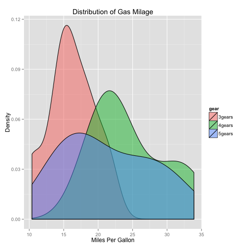
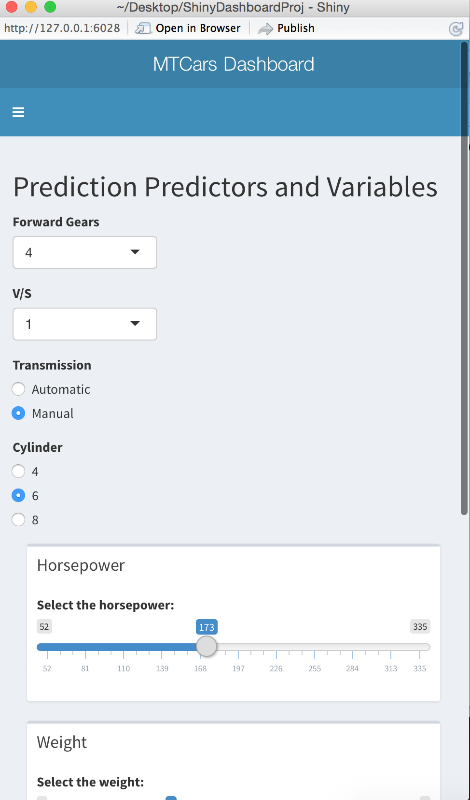
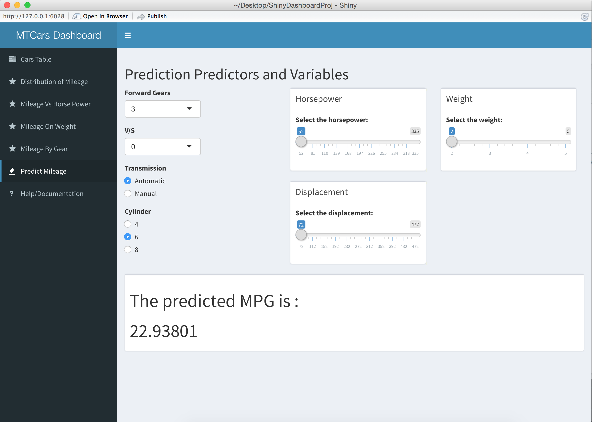

## Shiny Management Dashboard

The cloud has enabled disparate apps and websites to gather big data into central databases. However, such data would be useless if these are not processed into meaningful information. 

Current market practices make use of Python, Javascript (especially Angularjs), and a host of walled solutions like Tableau, to create management dashboards. However, R, of which Shiny is based on, is the preferred environment for data scientists who have strong background in Statistics. This is a very important distinction because it is dangerous to pass on data interpretation to pure coders who can create graphs from the data without the necessary background in Statistics. Moreover, R can process big data in advanced ways.

--- .class #plots

## Plots with ggplot2

The output can render plots, for example, using ggplot2: 


```r
dataCars$am <- factor(mtcars$am,levels=c(0,1), labels=c("Automatic","Manual")) 
```

 

--- .class #id


## Responsive in smaller devices

<div style='text-align: center;'>
    
</div>

--- .class #id

## Interactive

<div style='text-align: center;'>
    
</div>

--- .class #id

## Conclusion

As a mobile apps developer and manager of cloud projects, I am very much aware of the need for powerful management dashboards. R and Shiny seem to hold the solution for the need to create a unique dashboard that is free, open source, easy to learn, attractive to look at, interactive, can communicate with remote data, and very powerful for analyzing big data.

This project is a version 0.1 development of a management dashboard. It does not attempt to pull data from a remote data source as the initial objective is only to create an attractive and interactive dashboard that can collect user input, submit to a server code, process the input in the server code, and then display the result in the client dashboard. 

I hope I have convinced you to use shiny management dashboard.


